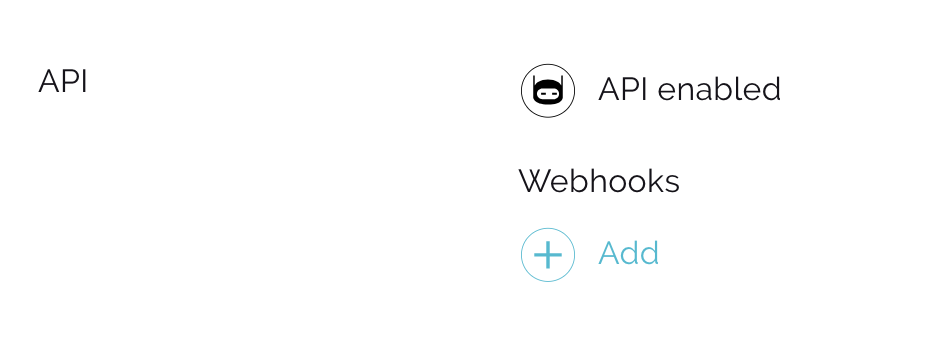
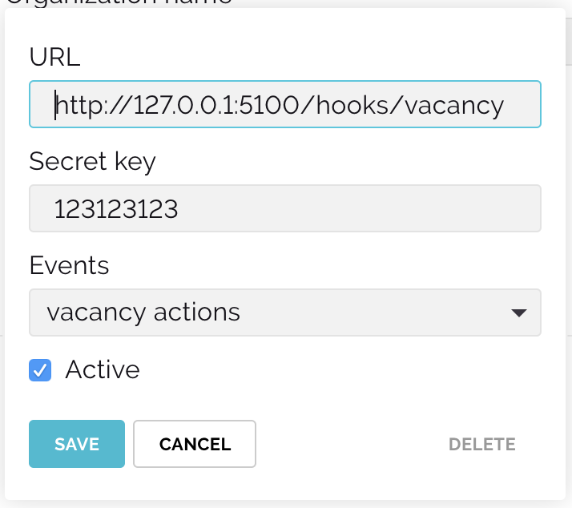
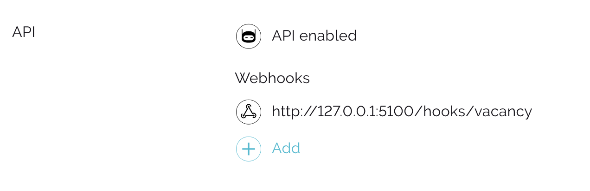

# Webhooks

## What are webhooks?
Webhooks are an easy way to notify your inner systems about actions that happen with candidates in Huntflow. 

Huntflow can send candidate's data to CRM system 1C or intranet if the candidate is moved to the stage "Work commencement". You can develop a chatbot which will send links to the candidate to Slack or Telegram. 

## Technical side of things
Technically, webhook is a POST request, that out system sends to your remote server. All the inforamtion about subject, object and changes of data is contained in the body of the request and its headers.

## How to create a webhook?
1. Go to company settings. 
2. Get sure that API is enabled.



3. Add a webhook, state an URL, secret key (optional) and choose events you want to subscribe to. When you add a webhook, the system checks its validity. To pass this check the server should return the code `200` or `204` to the PING-type request.



4. If the check is successful, the webhook will be added (you can add up to 5 webhooks). You can edit or delete webhooks after creating. To do that, click on the certain line from the list. 



<a name="event-types"></a>

## Event types
 - APPLICANT — actions with a candidate
 - VACANCY — actions with vacancies 
 - OFFER - actions with offers
 - PING — check of validity of a webhook


## Webhook headers
 ```json
 {
     "X-Huntflow-Delivery": "fcb5de9e-75a9-42c7-a7d2-3f070f2c5e00",
     "X-Huntflow-Event": "APPLICANT",
     "X-Huntflow-Signature": "298d0211223cf9b504c04674d3b7dbf9627803818098fdf3cec6f50cabb15b76"
 }
 ```

 | Header | Description |
 | --------- | -------- |
 | X-Huntflow-Delivery | Unique webhook ID |
 | X-Huntflow-Event | [Event type](#event-types) |
 | X-Huntflow-Signature | hex digest sha256 hmac of webhook body, generated with a secret key (doesn't exist if the webhook has no secret key stated) |


## Webhook body

### APPLICANT

```json
{
    "event": {
        "id": 1,
        "type": "COMMENT",
        "applicant": {
                "id": 1,
                "first_name": "Doe",
                "last_name": "John",
                "middle_name": "Michael",
                "birthday": "1970-01-01",
                "photo": {
                    "id": 1307833,
                    "content_type": "image/png",
                    "name": "477233672.png",
                    "url": "https://store.huntflow.ru/uploads/named/4/8/5/485cc4914d214065784507b1275fc143.png/477233672.png?s=7hq2usgld1uqC9k5-AcwkA&e=1504005423"
                }
            },
        "vacancy": {
            "id": 1,
            "position": "Manufacturing Engineer",
            "company": "Tesla",
            "money": "$100k",
            "state": "OPEN",
            "hidden": false,
            "priority": 1,
            "deadline": null,
            "account_division": {
                "id": 1,
                "name": "name"
            },
            "account_region": {
                "id": 1,
                "name": "name"
            },
            "created": "2017-06-22"
        },
        "status": {
            "id": 3,
            "name": "Declined"
        },
        "rejection_reason": {
            "id": 4,
            "name": "Does not meet the qualifications"
        },
        "comment": null,
        "created": "2017-08-22T18:16:27+03:00"
    },
    "agreement": {
        "state": "not_sent",
        "decision_date": null
    },
    "author": {
        "id": 4,
        "name": "David Smith",
        "email": "smith@example.com"
    },
    "account": {
        "id": 6,
        "name": "San Carlos Recruitment"
    }
}
```

- a.b denoted sn object 'a' with a key 'b'


|  Name | Type | Description |
| --- | --- | -------- |
| event.id | number | Action ID |
| event.type | string | [Action type](#action-types) |
| event.applicant.id | number | Candidate ID |
| event.applicant.first_name | string | Candidate's first name |
| event.applicant.last_name | string | Candidate's last name |
| event.applicant.middle_name | string | Candidate's middle name |
| event.applicant.birthday | string | Candidate's birthday date |
| event.applicant.photo.url | string | Link to a candidate's photo |
| event.vacancy.id | number | Vacancy ID |
| event.vacancy.position | string | Occupation name |
| event.vacancy.company | string | Department (`null`, if the departments are enabled) |
| event.vacancy.money | string | Salary |
| event.vacancy.state | string | The state of vacancy |
| event.vacancy.hidden | bool | Is the vacancy hidden from the colleagues? |
| event.vacancy.priority | number | The priority of a vacancy (0 for usual or 1 for high) |
| event.vacancy.deadline | date | Due date for a vacancy |
| event.vacancy.account_division.id | number | Department identifier (if the DEPARTMENTS are enabled) |
| event.vacancy.account_division.name | string | Department name (if the DEPARTMENTS are enabled) |
| event.vacancy.account_region.id | number | Region identifier (if the REGIONS are enabled) |
| event.vacancy.account_region.name | string | Region name (if the REGIONS are enabled |
| event.vacancy.created | string | Date and time of creating a vacancy |
| event.status.id | number | Stage of headhunting ID |
| event.status.name | string | Stage of headhunting name |
| event.rejection_reason.id | number | The identifier of the rejection reason |
| event.rejection_reason.name | string | The name of the rejection reason |
| event.comment | string | Comment text |
| event.created | date+time	| Date and time of making an action |
| author.id | number | Action author ID |
| author.name | string | Action author name |
| author.email | string | Action authoe email address |
| account.id | number | Company ID |
| account.name | string | Company name |

<a name="action-types"></a>

##### Types of actions with a candidate

| Type | Description |
| --- | -------- |
| ADD | Adding a candidate to the base |
| VACANCY-ADD | Adding a candidate to the vacancy |
| STATUS | Change of candidate's headhunting stage |
| COMMENT | Comment of candidate |


### VACANCY

```json
{
    "event": {
        "vacancy": {
            "created": "2017-10-19",
            "money": null,
            "company": null,
            "priority": 0,
            "state": "OPEN",
            "deadline": null,
            "account_division": {
                "id": 1,
                "name": "name"
            },
            "account_region": {
                "id": 1,
                "name": "name"
            },
            "grade": {
                "foreign": "202301",
                "id": 7,
                "name": "1.2"
            },
            "position": "Web developer",
            "body": "<p>Responsibilities</p>",
            "requirements": "<p>Requirements</p>",
            "conditions": "<p>Conditions</p>",
            "hidden": false,
            "id": 28
        },
        "type": "EDIT",
        "id": 972,
        "created": "2018-01-11T09:54:15+03:00"
    },
    "account": {
          "id": 2,
          "name": "Huntflow"
    }
}
```

- a.b denotes an object 'a' with a 'b' key


|  Name | Type | Description |
| --- | --- | -------- |
| event.id | number | Action ID |
| event.type | string | [Action type](#vacancy-action-types) |
| event.applicant.id | number | Candidate ID |
| event.applicant.first_name | string | Candidate's first name |
| event.applicant.last_name | string | Candidate's last name |
| event.applicant.middle_name | string | Candidate's middle name |
| event.applicant.birthday | string | Candidate's birthday date |
| event.applicant.photo.url | string | Link to a candidate's photo |
| event.vacancy.id | number | Vacancy ID |
| event.vacancy.position | string | Occupation name |
| event.vacancy.company | string | Department (`null`, if the departments are enabled) |
| event.vacancy.money | string | Salary |
| event.vacancy.state | string | The state of vacancy |
| event.vacancy.hidden | bool | Is the vacancy hidden from the colleagues? |
| event.vacancy.priority | number | The priority of a vacancy (0 for usual or 1 for high) |
| event.vacancy.deadline | date | Due date for a vacancy |
| event.vacancy.account_division.id | number | Department identifier (if the DEPARTMENTS are enabled) |
| event.vacancy.account_division.name | string | Department name (if the DEPARTMENTS are enabled |
| event.vacancy.account_region.id | number | Region identifier (if the REGIONS are enabled) |
| event.vacancy.account_region.name | string | Region name (if the REGIONS are enabled |
| event.vacancy.body | string | Responsibilities in HTML format|
| event.vacancy.requirements | string | Requirements in HTML format |
| event.vacancy.conditions | string | Conditions in HTML format |
| event.vacancy.grade | object | The example of implemented additional vacancy field of the directory value type |
| event.vacancy.grade.id | number | The ID of the value from the directory |
| event.vacancy.grade.name | string | The name of the value from a directory |
| event.vacancy.grade.foreign | string | Value ID in the external system (can be `null`) |
| event.vacancy.created | string | Date and time of creating a vacancy |
| event.created | date+time	| Date and time of creating an event |
| account.id | number | Company ID |
| account.name | string | Company name |

<a name="vacancy-action-types"></a>

##### Vacancy action types

| Type | Description |
| --- | -------- |
| CREATED | The vacancy is created |
| OPEN | The vacancy is opened or reopened |
| CLOSED | The vacancy is closed |
| HOLD | The work on the vacancy is paused |
| RESUME | The work on vacancy was resumed (after pause) |
| EDIT | The vacancy is edited |
| JOIN | The user has joined the work on vacancy (event will have a field `user` added) |
| LEAVE | The user stopped working on a vacancy (event will have a field `user` added) |


### OFFER

```json
{
  "event": {
    "id": 17,
    "applicant_offer": {
      "id": 10,
      "created": "2021-03-03 22:38:40",
      "account_applicant_offer": {
        "last_name": "Last",
        "first_name": "First",
        "middle_name": "qwe",
        "cv_from": 2653,
        "position_name": 8765,
        "account_division": 7982,
        "division": 10674,
        "schedule": 8762,
        "money": null,
        "money_partly": null,
        "grade": 8787,
        "contract": 1234,
        "probation": 4646,
        "address": 10673,
        "compensation": "<ul><li>compensation</li></ul>",
        "_relocation": {
          "relocation": "Нет",
          "relocation_bonus": null
        },
        "offer_date": "03.03.2021",
        "cost_center": 4665,
        "approval": [
          10527
        ],
        "approval_comment": null,
        "evaluate": 10526,
        "_guidelist": {
          "guidelist": "Нет",
          "replaced_name_decret": null,
          "surcharge": null,
          "func_manager": null,
          "project_name": null,
          "project_finish": null,
          "dms": null,
          "employment_date": null,
          "reg_date": null,
          "reg_time": null,
          "guidelist_comment": null,
          "reg_employee": null
        },
        "id": 14
      }
    },
    "type": "EDIT",
    "created": "2021-03-03T22:39:22+03:00"
  },
  "account": {
    "id": 5,
    "name": "Test organization"
  },
  "author": {
    "id": 1,
    "name": "Test author",
    "email": "test@example.com",
    "meta": null
  }
}
```

- a.b denotes an object 'a' with a 'b' key


|  Name | Type | Description |
| --- | --- | -------- |
| event.id | number | Action ID |
| event.type | string | [Action type](#offer-action-types) |
| event.applicant_offer.id | number | Offer ID |
| event.applicant_offer.account_applicant_offer | object | Body of the company offer |
| event.applicant_offer.created | datetime | Date and time when the offer was created
| event.created | datetime	| Date and time of creating an event |
| author.id | number | Action author ID |
| author.name | string | Action author name |
| author.email | string | Action author email |
| account.id | number | Company ID |
| account.name | string | Company name |


<a name="offer-action-types"></a>

##### Offer action types

| Type | Description |
| --- | -------- |
| ADD | Offer added |
| EDIT | Offer edited |
