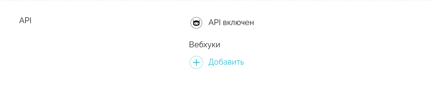
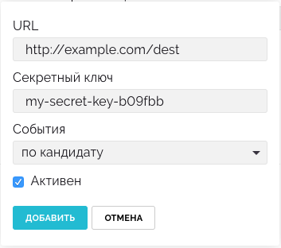
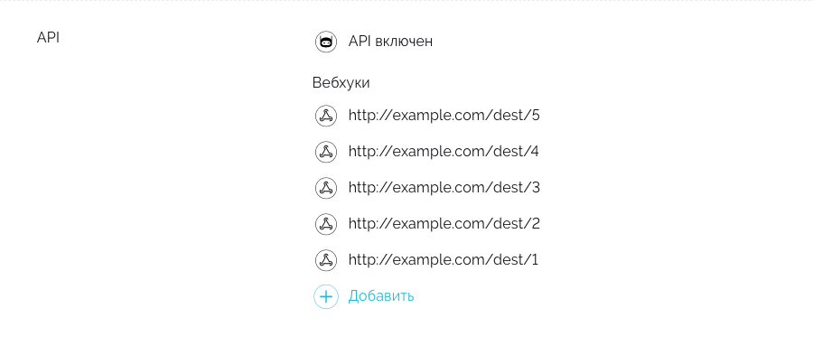

# Вебхуки

## Что такое вебхуки
Вебхуки — это удобный способ оповещать ваши внутренние системы о действиях с кандидатами в Хантфлоу.

Хантфлоу может отправлять данные кандидата в ваш 1С или интранет при переводе кандидата на этап «Выход на работу». Или вы можете разработать чат-бота, который будет отправлять заказчику ссылку на кандидата в Слак или Телеграм.

## Технически
С технической точки зрения вебхук – это HTTP POST-запрос, отправляемый нашей системой на ваш удаленный сервер. Вся информация о субъекте, объекте и характере изменения данных содержится в теле запроса и в его заголовках.

## Как создать вебхук
1. Перейдите в настройки организации
2. Убедитесь, что у вас подключен API



3. Добавьте вебхук, указав URL, секретный ключ (опционально) и выбрав события,
на которые вы хотите подписаться. Обратите внимание, что при добавлении вебхука
система проверяет его на доступность. Для прохождения этой проверки, удаленный
сервер должен ответить кодом `200` или `204` на запрос с типом PING.



4. В случае успешной проверки, вебхук будет добавлен (всего можно добавлять до 5 вебхуков).
Вы можете редактировать или удалять вебхуки после создания, нажав на интересующую
вас запись в списке.



## Отправка и получение событий
На каждый созданных вебхук Хантфлоу будет предпринимать до 4-х попыток отправить событие: сразу после возникновения, а также, в случае неуспешной доставки, с интервалами в 10, 100 и 1000 секунд после последней неуспешной попытки. 

Сервис принимающий наши события должен корректно отвечать кодом `200` или `204`, информируя о том что событие было получено. 


<a name="event-types"></a>

## Типы событий
 - APPLICANT — действия над кандидатом
 - VACANCY — действия по вакансиям
 - RESPONSE — действия по откликам
 - OFFER - действия по офферам
 - RECRUITMENT-EVALUATION - действия по опросу оценки работы рекрутеров
 - PING — проверка на доступность вебхука


## Заголовки вебхука
 ```json
 {
     "X-Huntflow-Delivery": "fcb5de9e-75a9-42c7-a7d2-3f070f2c5e00",
     "X-Huntflow-Event": "APPLICANT",
     "X-Huntflow-Signature": "298d0211223cf9b504c04674d3b7dbf9627803818098fdf3cec6f50cabb15b76"
 }
 ```

 | Заголовок | Описание |
 | --------- | -------- |
 | X-Huntflow-Delivery | Уникальный идентификатор вебхука |
 | X-Huntflow-Event | [Тип события](#event-types) |
 | X-Huntflow-Signature | hex digest sha256 hmac тела вебхука, сгенерированный с помощью секретного ключа (отсутствует, если в вебхуке не указан секретный ключ) |


## Тело вебхука


<details>
<summary>Webhooks 2.0</summary>
 
Основное изменение данной версии заключается в том, что вебхуки приходят не только при возникновении событий, но и их изменении. Например, при создании встречи в календаре будет отправлен вебхук с информацией о встрече. Однако, если время в событии изменится, то в версии 1.0 событие об изменении не будет отправлено (в отличие от версии 2.0).
 
### Основные поля в теле вебхука

 - `changes` — Содержит список измененных полей и их предыдущие значения. На текущий момент функционал реализован для вебхуков типа `APPLICANT`. Внешняя система должна учитывать, что изменения могут приходить и по другим типам вебхуков.

 - `event` – Основная информация о событии. Подробно описана ниже для каждого типа вебхуков.

 - `meta` – Общая информация о вебхуке:

     - `account` – Объект с данными об организации

         - `id` (тип `number`) – идентификатор организации

         - `name` (тип `str`) – название организации

         - `nick` (тип `str`) – псевдоним организации

     - `author` – Объект с данными об авторе действия

         - `id` (тип `number`) – идентификатор автора

         - `email` (тип `str`) – почта автора

         - `name` (тип `str`) – имя автора

         - `meta` (тип `object`) – дополнительные данные автора
 
     - `event_id` (тип `str`) - уникальный идентификатор события (вебхука)
 
     - `event_type` (тип `str`) – тип события, вызвавший отправку вебхука

     - `retry` (тип `number`) – номер попытки отправки вебхука (0 - 3).

     - `version` (тип `str`) – версия схемы вебхука (например, `2.0`)

     - `webhook_action` (тип `str`) – тип действия, вызвавшего вебхук (добавление – `ADD`, изменение – `EDIT`, удаление – `DELETE`). `EDIT`, на данный момент, используется только в вебхуках типа `APPLICANT`.
 
### Пример

Представим, что мы настроили вебхук на тип событий `APPLICANT`. 
Пользователь пишет комментарий по кандидату и в результате приходит вебхук:

```json
{
  "changes": {},
  "event": {
    "applicant_log": {
      "id": 860,
      "type": "COMMENT",
      "comment": "Хороший кандидат",
      ...      
    },
    "applicant": {
      ...
    }
  },
  "meta": {
    "event_id": "15", 
    "event_type": "APPLICANT",    
    "version": "2.0",
    "retry": 0,
    "webhook_action": "ADD",
    ...
  }
}
``` 

Была создана новая сущность (запись по кандидату c идентификатором `860`), поэтому `webhook_action` равен `ADD`.

Теперь пользователь решил отредактировать комментарий, что вызовет следующий вебхук:

```json
{
  "changes": {
    "applicant_log": {
      "comment": {
        "from": "Хороший кандидат"
      }
    }
  },
  "event": {
    "applicant_log": {
      "id": 860,
      "type": "COMMENT",
      "comment": "Хороший кандидат, нужно звать на собеседование",
      ...
    },
    "applicant": {
      ...
    }
  },
  "meta": {
    "event_id": "16", 
    "event_type": "APPLICANT",    
    "version": "2.0",
    "retry": 0,
    "webhook_action": "EDIT",
    ...
  }
}
```

Была изменена сущность (запись по кандидату c идентификатором `860`), поэтому `webhook_action` равен `EDIT`, а в `changes` описано какие поля изменились и их предыдущие значения.

Далее пользователь передумал и решил удалить свой комментарий, что вызовет следующий вебхук:

```json
{
  "changes": {},
  "event": {
    "applicant_log": {
      "id": 860,
      "type": "COMMENT",      
      "comment": "Хороший кандидат, нужно звать на собеседование",
      ...
    },
    "applicant": {
      ...
    }
  },
  "meta": {
    "event_id": "17", 
    "event_type": "APPLICANT",    
    "version": "2.0",
    "retry": 0,
    "webhook_action": "DELETE",
    ...
  }
}
```

Сущность (комментарий по кандидату с идентификатором `860`) была удалена, поэтому `webhook_action` равен `DELETE`.
 
 
### Типы событий
  
<details>
 
<summary>APPLICANT</summary>
 
 ```json
 {
   "changes": {},
   "event": {
     "applicant": {
       "birthday": null,
       "company": null,
       "email": null,
       "first_name": "test_name",
       "last_name": "test",
       "middle_name": null,
       "money": null,
       "pd_agreement": null,
       "phone": null,
       "photo": null,
       "position": null,
       "questionary": "2021-10-05T10:49:22+03:00",
       "skype": null,
       "social": [
         {
           "id": 1,
           "social_type": "TELEGRAM",
           "value": "some_tg",
           "verification_date": null,
           "verified": false
         }
       ],
       "values": {
         "_reason": {
           "reason": "Замена",
           "reason_replacement": "sdG345"
         },
         "category": {
           "foreign": "2",
           "id": 3219,
           "meta": {
             "show": true
           },
           "name": "Руководитель"
         },
         "category_1": "sdgsg",
         "category_2": "sdgsdg",
         "category_3": "sdgsdg",
         "multi": [
           {
             "foreign": "3",
             "id": 3220,
             "meta": {
               "show": false
             },
             "name": "Специалист"
           },
           {
             "foreign": "4",
             "id": 3221,
             "meta": {
               "show": false
             },
             "name": "Рабочий персонал"
           }
         ],
         "multi_1": "dfgsd",
         "multi_2": "sdfgsdfg",
         "multi_3": "dsfgii"
       }
     },
     "applicant_log": {
       "calendar_event": {
         "all_day": false,
         "attendees": [
           {
             "contact_id": 1,
             "displayName": "tst_name",
             "email": "tst@example.com",
             "member": 13,
             "name": "tst_name",
             "order": 1,
             "resource": false,
             "responseStatus": "needsAction"
           }
         ],
         "created": "2021-10-05T06:00:21+03:00",
         "creator": {
           "displayName": null,
           "email": "tst@example.com",
           "self": true
         },
         "description": "fgd",
         "end": "2021-10-05T13:00:19+03:00",
         "etag": "1633413621888",
         "event_type": "interview",
         "foreign": "20211005T060021_HF_12_9_true",
         "id": 2,
         "interview_type": 45,
         "location": null,
         "name": "Интервью: test test_name – fdg",
         "recurrence": [],
         "reminders": [
           {
             "method": "popup",
             "minutes": 15
           }
         ],
         "start": "2021-10-05T12:00:19+03:00",
         "state": "SENT",
         "status": "confirmed",
         "timezone": "Europe/Moscow",
         "transparency": "busy",
         "conference": {
           "id": 67,
           "topic": "Interview: Иванов Иван – Тестировщик",
           "auth_type": "ZOOM",
           "created": "2021-12-23T15:52:59+03:00",
           "changed": "2021-12-23T15:53:04+03:00",
           "start_time": "2021-12-23T16:00:55+03:00",
           "end_time": "2021-12-23T17:00:55+03:00",
           "timezone": "Europe/Moscow",
           "link": "https://zoom.us/j/123456789?pwd=VmtRL3qwedfqwedffqsdfqwefr",
           "access_code": "Hdeees6e",
           "state": "waiting",
           "foreign": "123456789"
         }
       },
       "comment": null,
       "created": "2021-10-05T11:00:21+03:00",
       "employment_date": "2021-10-05",
       "files": [],
       "id": 37,
       "rejection_reason": null,
       "removed": null,
       "source": null,
       "status": null,
       "survey_answer_of_type_a": null,
       "type": "COMMENT",
       "vacancy": {
         "account_division": null,
         "account_region": null,
         "applicants_to_hire": 1,
         "company": "jkl",
         "created": "2021-10-05",
         "deadline": null,
         "fill_quotas": [
           {
             "applicants_to_hire": 1,
             "closed": null,
             "created": "2021-10-05 10:49:22",
             "deadline": null,
             "id": 9,
             "vacancy_request": null
           }
         ],
         "frame_id": 9,
         "hidden": false,
         "id": 9,
         "money": "325",
         "multiple": false,
         "parent": null,
         "position": "fdg",
         "priority": 0,
         "state": "OPEN",
         "values": {}
       },
       "vacancy_group_action": null
     },
     "applicant_tags": [
       {
         "id": 1,
         "name": "Blacklist",
         "color": "000000"
       }
     ]
   },
   "meta": {
     "account": {
       "id": 14,
       "name": "tst",
       "nick": "tsthr"
     },
     "author": {
       "email": "tst@example.com",
       "meta": {},
       "id": 13,
       "name": "tst_name"
     },
     "event_type": "APPLICANT",
     "payload_id": 8,
     "retry": 0,
     "version": "2.0",
     "webhook_action": "ADD"
   }
 }
 ```
 
 
 #### Кандидат (applicant)
 
| Имя | Тип | Описание |
| --- | -------- | --------- |
| id | number | Идентификатор кандидата |
| birthday | datetime | Дата рождения |
| company | number | Последняя компания, в которой работал кандидат |
| email|string|Электронная почта|
| first_name|string|Имя|
| last_name|string|Фамилия|
| middle_name|string|Отчество|
| money|string|Желаемая зарплата|
| pd_agreement|object|Соглашение об обработке персональных данных|
| phone|string|Контактный телефон|
| photo|object|Фотография кандидата|
| questionary|datetime|Дата заполнения\изменения дополнительной информации|
| skype|string|Ник в скайпе|
| social|object|Социальные сети кандидата|
| values|object|Дополнительные поля кандидата|
 
 #### Соглашение об обработке персональных данных (applicant.pd_agreement)
 
| Имя | Тип|Описание|
| --- | -------- | --------- |
| state|string|Согласие\несогласие кандидата|
| decision_date|datetime|Дата ответа|
 
 #### Фото (applicant.photo)
 
| Имя |Тип|Описание|
| --- | -------- | --------- |
|id|number|Идентификатор файла|
|content_type|string|MIME тип|
|name|string|Имя файла|
|url|string|Ссылка на фотографию кандидата|

 #### Социальные сети (applicant.social)
 
|Имя|Тип|Описание|
| --- | -------- | --------- |
|id|number|Идентификатор|
|social_type|string|Тип социальной сети|
|verification_date|datetime|Дата последней верификации|
|verified|bool|Аккаунт верифицирован (существует)|
 
 #### Список меток/тегов кандидата (applicant_tags)
 
| Имя | Тип | Описание |
| --- | -------- | --------- |
| id | number | Идентификатор метки |
| name | string | Название метки |
| color | string | Цвет метки |
 
 #### Лог кандидата (applicant_log)
 
|Имя|Тип|Описание|
| --- | -------- | --------- |
|id|number|Идентификатор лога|
|type|string|Тип лога|
|calendar_event|object|Встреча в календаре|
|comment|string|Комментарий|
|created|datetime|Дата создания лога|
|employment_date|date|Дата найма|
|files|list[objects]|Cписок файлов, прикрепленных к логу|
|status|object|Статус кандидата на вакансии|
|rejection_reason|object|Причина отказа|
|removed|datetime|Дата удаления записи|
|source|string|Источник кадидата|
|survey_answer_of_type_a|object|Форма оценки кандидата по вакансии|
|vacancy|object|Данные вакансии. см. вебхук VACANCY|
 
 #### Файл (applicant_log.files[file])
 
|Имя|Тип|Описание|
|--------|--------|--------|
|id|number|Идентификатор файла|
|content_type|string|MIME тип|
|name|string|Имя файла|
|url|string|Ссылка на файл кандидата|
 
 #### Форма оценки кандидата по вакансии (applicant_log.survey_answer_of_type_a)
 
 |Имя|Тип|Описание|
|--------|--------|--------|
|id|number|Идентификатор записи|
|respondent|object|Респондент|
|survey|object|Опрос|
|created|datetime|Дата создания опросника|
|upadted|datetime|Дата изменения опросника|
|values|object|Результаты опроса (имя поля - ответ)|
 
 #### Респондент (applicant_log.survey_answer_of_type_a.respondent)
 
 |Имя|Тип|Описание|
|--------|--------|--------|
|account_id|number|Идентификатор аккаунта|
|custom_id|number|name|
|string|Имя респондента|email|
|string|Почта респондента|
 
 #### Опрос (applicant_log.survey_answer_of_type_a.survey)
 
 |Имя|Тип|Описание|
|--------|--------|--------|
|id|number|Идентификатор опроса|
|name|string|Название формы опроса|
|type|string|Тип опроса (type_a \ type_r)|
|created|datetime|Дата создания опроса|
|updated|datetime|Дата изменения опроса|
|active|bool|Активен ли опрос|
 
 #### Причина отказа (applicant_log.rejection_reason)
 
 |Имя|Тип|Описание|
|--------|--------|--------|
|id|number|Идентификатор записи|
|name|string|Причина отказа|
 
 #### Статус (applicant_log.status)
 
 |Имя|Тип|Описание|
|--------|--------|--------|
|id|number|Идентификатор записи|
|name|string|Статус|
 
 #### Назначенная встреча в календаре (applicant_log.calendar_event)
 |Имя|Тип|Описание|
|--------|--------|--------|
|id|number|Идентификатор события|
|name|string|Название события|
|description|string|Описание события|
|status|string|Статус события|
|event_type|string|Тип события|
|start|datetime|Дата и время начала события|
|end|datetime|Дата и время окончания события|
|timezone|string|Название часового пояса события|
|attendees|list|Участники события|
|created|datetime|Дата и время создания события|
|creator.displayName|string|Имя создателя события|
|creator.email|string|Email создателя события|
|creator.self|boolean|Флаг указывающий на то, что вы создатель события|
|reminders|list|Список напоминаний|
|reminders.method|string|Способ напоминания|
|reminders.minutes|number|За сколько минут до начала события сработает напоминание|
|all_day|boolean|Флаг указывающий на то, что событие запланировано на весь день|
|foreign|string|Внешний уникальный идентификатор события|
|recurrence|list|Список повторений RFC 5545|
|etag|string|ETag события|
|location|string|Географическое местоположение события|
|transparency|string||
|conference|object|Конференция в Zoom|
 
#### Участники встречи, назначенной в календаре (applicant_log.calendar_event.attendees) 
 
 |Имя|Тип|Описание|
|--------|--------|--------|
|displayName|string|Имя участника события|
|email|string|Email участника события|
|responseStatus|string|Статус участника события|
|contact_id|number|member|
|number|order|number|
|resource|bool||

 #### Конференция в календаре (applicant_log.calendar_event.conference)
 |Имя|Тип|Описание|
|--------|--------|--------|
|id|number|Идентификатор конференции|
|topic|string|Название конференции|
|auth_type|string|Тип авторизации|
|state|string|Статус конференции|
|start_time|datetime|Дата и время начала конференции|
|end_time|datetime|Дата и время окончания конференции|
|timezone|string|Название часового пояса|
|created|datetime|Дата и время создания конференции|
|changed|datetime|Дата и время изменения конференции|
|foreign|string|Внешний уникальный идентификатор конференции|
|link|string|Ссылка на конференцию|
|access_code|string|Код доступа|
 
<a name="action-types"></a>

##### Типы действий над кандидатом

| Тип | Описание |
| --- | -------- |
| ADD | Добавление кандидата в базу |
| VACANCY-ADD | Добавление кандидата на вакансию |
| STATUS | Изменение этапа подбора кандидата |
| COMMENT | Комментарий по кандидату |
| REMOVED | Кандидат удален |
| DOUBLE | Объединение дубликатов |
| AGREEMENT | Действие с согласием на хранение Персональных Данных |

<a name="event-status"></a>

##### Статусы событий календаря

| Тип | Описание |
| --- | -------- |
| confirmed | Подтверждение
| tentative | Предварительное подтверждение
| cancelled | Отказ
| needsAction | Без ответа

<a name="event-type"></a>

##### Типы событий календаря

| Тип | Описание |
| --- | -------- |
| interview | Интервью
| other | Другое

<a name="event-reminder-method"></a>

##### Способы напоминаний

| Тип | Описание |
| --- | -------- |
| popup | Всплывающее окно
| email | На адрес электронной почты

<a name="event-transparency"></a>

##### Типы доступности

| Тип | Описание |
| --- | -------- |
| busy | Занят
| free | Свободен


<a name="pd-agreement-state"></a>

##### Состояния согласия на хранение Персональных Данных

| Тип | Описание |
| --- | -------- |
| not_sent | запрос не отправлялся
| sent | запрос отправлен, но ответ не получен
| accepted | получено согласие на хранение
| declined | получен отказ на хранение

</details>

<details>
<summary>VACANCY</summary>
 
 ```json
{
    "changes": {},
    "event": {
        "vacancy": {
            "account_division": null,
            "account_region": null,
            "applicants_to_hire": 1,
            "body": null,
            "company": "jkl",
            "conditions": null,
            "created": "2021-10-05",
            "deadline": null,
            "fill_quotas": [
                {
                    "applicants_to_hire": 1,
                    "closed": null,
                    "created": "2021-10-05T10:49:22+03:00",
                    "deadline": null,
                    "id": 9,
                    "vacancy_request": null
                }
            ],
            "frame_id": 9,
            "hidden": false,
            "id": 9,
            "money": "325",
            "multiple": false,
            "parent": null,
            "position": "fdg",
            "priority": 0,
            "requirements": null,
            "state": "OPEN",
            "values": {}
        },
        "vacancy_log": {
            "created": "2021-10-05T10:49:22+03:00",
            "id": 27,
            "state": "JOIN"
        }
    },
    "meta": {
        "account": {
            "id": 14,
            "name": "tst",
            "nick": "tsthr"
        },
        "author": {
            "id": 13,
            "name": "tst_name",
            "email": "tst@example.com",
            "meta": {}
        },
        "event_type": "VACANCY",
        "retry": 0,
        "version": "2.0",
        "webhook_action": "ADD"
    }
}
 ```
 
 #### Лог вакансии (vacancy_log)
 
| Имя | Тип | Описание |
| --- | -------- | --------- |
| id | number | Идентификатор действия |
| created | datetime | Дата и время создания события |
| type | string | Тип действия |
| reason | string | Текст причины отклонения заявки, в случае когда по заявке принято решение "Не брать в работу") |
  
 #### Вакансия (vacancy)
 
| Имя | Тип | Описание |
| --- | -------- | --------- |
| id | number | Идентификатор вакансии |
| position | string | Название вакансии (должности) |
| company | string | Отдел, подразделение (null, если подключены подразделения) |
| money | string | Зарплата |
| state | number | Статус вакансии |
| hidden | bool | Скрыта ли вакансия от коллег |
| priority | number | Приоритет вакансии (может быть или 0 (обычный), или 1 (высокий)) |
| deadline | date | Дата дедлайна по вакансии |
| account_division | object | Подразделение (если подразделения подключены) |
| account_region | object | Регион |
| body | string | Обязанности в формате HTML |
| requirements | string | Требования в формате HTML |
| conditions | string | Условия в формате HTML |
| created | datetime | Дата и время создания вакансии |
| values | object | Дополнительные поля вакансии |
| frame_id | number | Идентификатор текущего фрейма вакансии |
| fill_quotas | list | Список квот вакансии |
| applicants_to_hire | number | Количество кандидатов к найму |
 
  #### Подразделения (vacancy.account_division)
 
| Имя | Тип | Описание |
| --- | -------- | --------- |
| id | number | Идентификатор подразделения |
| name | string | Название подразделения |
 
   #### Регион (vacancy.account_region)
 
| Имя | Тип | Описание |
| --- | -------- | --------- |
| id | number | Идентификатор региона |
| name | string | Название региона |
   
  #### Квоты (vacancy.fill_quotas)
 
| Имя | Тип | Описание |
| --- | -------- | --------- |
| id | number | Идентификатор квоты |
| applicants_to_hire | number | Количество кандидатов к найму |
| created | datetime | Дата создания квоты |
| closed | datetime | Дата закрытия квоты |
| deadline | date | Дата дедлайна квоты |
| vacancy_request | number | Идентификатор запроса на создание вакансии |
 
 
   #### Типы действий по вакансиям 
 
| Тип  | Описание |
| ---  | --------- |
| CREATED  | Вакансия создана |
| OPEN  | Вакансия открыта / переоткрыта |
| CLOSED  | Вакансия закрыта |
| HOLD  | Работа по вакансии приостановлена |
| RESUME  | Работа по вакансии возобновлена (после приостановки) |
| EDIT  | Вакансия отредактирована |
| JOIN  | Пользователь присоединился к работе по вакансии (к событию будет добавлено поле user) |
| LEAVE  | Пользователь перестал работать по вакансии (к событию будет добавлено поле user) |
 </details>
 
 <details>
  <summary> VACANCY-REQUEST </summary>
  
  ```json
{
    "changes": {},
    "event": {
        "vacancy_request": {
            "account_vacancy_request": 16,
            "created": "2021-10-05T10:50:16+03:00",
            "id": 6,
            "position": "ret",
            "values": {
                "body": "<p>body</p>",
                "comment": "comment",
                "company": "test_company",
                "money": "3000000000",
                "position": "test_position",
                "requirements": "<p>test_requirements</p>"
            }
        },
        "vacancy_request_log": {
            "action": "CREATE",
            "created": "2021-10-05T10:50:16+03:00",
            "id": 6
        }
    },
    "meta": {
        "account": {
            "id": 14,
            "name": "tst",
            "nick": "tsthr"
        },
        "author": {
            "id": 13,
            "name": "tst_name"
        },
        "event_type": "VACANCY-REQUEST",
        "retry": 0,
        "version": "2.0",
        "webhook_action": "ADD"
    }
}
  ```
  
  #### Заявка на вакансию (vacancy_request)
  
|Имя|Тип|Описание|
|--------|--------|--------|
|id|number|Идентификатор заявки|
|position|string|Название вакансии|
|created|datetime|Дата создания заявки|
|account_vacancy_request|number||
|values|object|Поля заявки|
  
  #### Лог заявки на вакансию (vacancy_request_log)
  
  |Имя|Тип|Описание|
|--------|--------|--------|
|action|string|Действие|
|created|datetime|Дата создания лога|
|id|number|Идентификатор записи|
  
  </details>
 
  
 <details>
  <summary> RESPONSE </summary>
  
  ```json
{
    "changes": {},
    "event": {
        "applicant_external_response": {
            "created": "2021-10-05T11:37:30+03:00",
            "data": {
                "body": "lorem ipsum body for 23"
            },
            "foreign": "external-9-23",
            "id": 179,
            "resume": null,
            "state": null,
            "updated": "2018-12-20T23:00:00+03:00"
        },
        "vacancy_external": {
            "account_vacancy_external": {
                "account_source": {
                    "foreign": null,
                    "id": 361,
                    "name": "mocked",
                    "type": "user"
                },
                "auth_type": "NATIVE",
                "id": 73,
                "name": "Mocked Site"
            },
            "created": "2021-10-05T11:37:25+03:00",
            "data": "comment",
            "foreign": "1633415845",
            "id": 9,
            "state": "PUBLISHED",
            "vacancy": {
                "account_division": null,
                "account_region": null,
                "applicants_to_hire": 1,
                "company": "company",
                "created": "2021-10-05",
                "deadline": null,
                "fill_quotas": [
                    {
                        "applicants_to_hire": 1,
                        "closed": null,
                        "created": "2021-10-05 10:23:10",
                        "deadline": null,
                        "id": 6,
                        "vacancy_request": null
                    }
                ],
                "frame_id": 6,
                "hidden": false,
                "id": 6,
                "money": null,
                "multiple": false,
                "parent": null,
                "position": "test_position",
                "priority": 0,
                "state": "OPEN",
                "values": {}
            }
        }
    },
    "meta": {
        "account": {
            "id": 14,
            "name": "tst",
            "nick": "tsthr"
        },
        "event_type": "RESPONSE",
        "retry": 0,
        "version": "2.0",
        "webhook_action": "ADD"
    }
}
  ```
  
  #### Отклик на вакансию с внешнего карьерного сайта (applicant_external_response)
  
  |Имя|Тип|Описание|
|--------|--------|--------|
|id|number|Идентификатор отклика|
|foreign|string|Внешний идентификатор отклика|
|resume|object|Резюме кандидата|
|state|string|Состояние отклика|
|created|datetime|Дата сохранения отклика в базе|
|updated|datetime|Дата создания/обновления отклика на карьерном сайте|
  
  #### Вакансия на внешнем карьерном сайте (vacancy_external)
  
  |Имя|Тип|Описание|
|--------|--------|--------|
|id|number|Идентификатор внешней вакансии|
|foreign|string|Внешний идентификатор вакансии|
|data|string||
|account_vacancy_external|object||
|state|string|Состояние вакансии|
|vacancy|object|см. вебхук VACANCY|
  
  #### Настройки вакансии на внешнем сайте (vacancy_external.account_vacancy_external)
  
  |Имя|Тип|Описание|
|--------|--------|--------|
|auth_type|string|Тип авторизации|
|id|number|Идентификатор записи|
|name|string|Текстовое название|
|account_source|object|Описание источника|
  
  #### Источник на внешнем сайте (vacancy_external.account_vacancy_external.account_source)
  
  |Имя|Тип|Описание|
|--------|--------|--------|
|foreign|string|Внешний идентификатор источника|
|id|number|Идентификатор записи|
|name|string|Имя источника|
|type|tring|Тип источника (системный\пользовательский)|
  
  </details>
 
   
 <details>
  <summary> OFFER </summary>
  
  ```json
  {
      "changes": {},
      "event": {
          "applicant": {
              "birthday": null,
              "company": null,
              "email": null,
              "first_name": "test_first",
              "id": 10,
              "last_name": "test_last",
              "middle_name": "test_middle",
              "money": null,
              "pd_agreement": null,
              "phone": null,
              "photo": null,
              "position": null,
              "questionary": null,
              "skype": null,
              "social": [],
              "values": {}
          },
          "applicant_offer": {
              "account_applicant_offer_log": {
                  "id": 1,
                  "type": "ADD"
              },
              "applicant_offer_id": 12,
              "created": "2021-10-26T14:12:50+03:00",
              "id": 1,
              "values": {
                  "offer_text": "<p>new_offer</p>",
                  "position_name": "ghfgdh",
                  "whom_date": "26.10.2021",
                  "whom_name": "test_last test_first test_middle"
              }
          },
          "vacancy": {
              "account_division": null,
              "account_region": null,
              "applicants_to_hire": 1,
              "body": null,
              "company": null,
              "conditions": null,
              "created": "2021-10-26",
              "deadline": null,
              "fill_quotas": [
                  {
                      "applicants_to_hire": 1,
                      "closed": null,
                      "created": "2021-10-26 14:12:16",
                      "deadline": null,
                      "id": 4,
                      "vacancy_request": null
                  }
              ],
              "frame_id": 4,
              "hidden": false,
              "id": 4,
              "money": null,
              "multiple": false,
              "parent": null,
              "position": "test_posititon",
              "priority": 0,
              "requirements": null,
              "state": "OPEN",
              "values": {}
          }
      },
      "meta": {
          "account": {
              "id": 14,
              "name": "tst",
              "nick": "tsthr"
          },
          "author": {
              "email": "tst@example.com",
              "id": 13,
              "meta": {},
              "name": "tst_name"
          },
          "event_type": "OFFER",
          "retry": 0,
          "version": "2.0",
          "webhook_action": "ADD"
      }
  }

```
  
  #### Предложение(applicant_offer)
  
  |Имя|Тип|Описание|
|--------|--------|--------|
|account_applicant_offer_log|object|Лог предложения|
|applicant_offer_id|number|Идентификатор аккаунт предложения|
|created|datetime|Дата создания|
|id|number|Идентификатор предложения|
|values|object|Дополнительные поля предложения|
  
  #### Лог предложения о работе (applicant_offer.account_applicant_offer_log)
  
  |Имя|Тип|Описание|
 |--------|--------|--------|
 |id|number|Иденитфикатор лога|
 |type|string|Тип лога|
  
  </details>


 <details>
  <summary> RECRUITMENT-EVALUATION </summary>
  
  ```json
  {
    "changes": {},
    "event": {
      "recruitment_evaluation": {
        "id": 1,
        "account_survey": {
          "id": 15,
          "name": "Оценка найма",
          "schema": {
            "type": "object",
            "required": [
              "stars",
              "comment"
            ],
            "properties": {
              "stars": {
                "type": "number",
                "title": "Общее впечатление о подборе",
                "maximum": 10,
                "minimum": 1
              },
              "comment": {
                "type": "string",
                "title": "Комментарий",
                "minLength": 3,
                "isNotEmpty": true
              }
            },
            "additionalProperties": false
          }
        },
        "survey_answer_requests": [
          {
            "id": 1,
            "respondent": {
              "id": 1,
              "account_id": 1,
              "custom_id": null,
              "name": "test@example.com",
              "email": "test@example.com"
            },
            "created": "2022-05-19T14:15:37+03:00",
            "state": "SENT"
          }
        ],
        "survey_answer": {
          "id": 1,
          "respondent": {
            "id": 1,
            "account_id": 1,
            "custom_id": null,
            "name": "test@example.com",
            "email": "test@example.com"
          },
          "data": {
            "comment": "Отличная работа! "
          },
          "created": "2022-05-19T14:16:23+03:00",
          "updated": "2022-05-19T14:16:23+03:00"
        },
        "stars": 10,
        "applicant": {
          "id": 236,
          "photo": null,
          "first_name": "test_name",
          "last_name": "test",
          "middle_name": null,
          "birthday": null,
          "position": null,
          "company": null,
          "money": null,
          "phone": null,
          "email": null,
          "skype": null,
          "questionary": null,
          "values": {},
          "social": [
            {
              "id": 1,
              "social_type": "TELEGRAM",
              "value": "some_tg",
              "verification_date": null,
              "verified": false
            }
          ],
          "pd_agreement": null
        },
        "vacancy": {
          "id": 10,
          "applicants_to_hire": 1,
          "position": "QA",
          "company": null,
          "money": "1",
          "state": "OPEN",
          "hidden": false,
          "priority": 0,
          "deadline": null,
          "account_division": {
            "id": 2,
            "name": "Отдел контроля качества"
          },
          "account_region": {
            "id": 4,
            "name": "name"
          },
          "created": "2022-05-19",
          "multiple": false,
          "parent": null,
          "values": {
            "reason": "Новая позиция",
            "category": {
              "id": 1,
              "name": "Специалист",
              "foreign": "Специалист",
              "meta": {
                "deadline": 35
              }
            }
          },
          "fill_quotas": [
            {
              "id": 1,
              "applicants_to_hire": 1,
              "deadline": "2022-05-19",
              "vacancy_request": 9,
              "created": "2022-05-19T14:15:14+03:00",
              "closed": "2022-05-19T14:15:37+03:00"
            }
          ],
          "frame_id": 1
        }
      }
    },
    "meta": {
      "account": {
        "id": 11,
        "name": "Huntflow",
        "nick": "huntflow"
      },
      "author": {
        "id": 1,
        "email": "test@example.com",
        "name": "test@example.com",
        "meta": null
      },
      "event_type": "RECRUITMENT-EVALUATION",
      "version": "2.0",
      "retry": 0,
      "webhook_action": "ADD",
      "event_id": "3"
    }
  }

```

  #### Оценка найма (recruitment_evaluation)
  
  | Имя                    | Тип          | Описание                     |
|------------------------|--------------|------------------------------|
| id                     | number       | Идентификатор оценки найма   |
| account_survey         | object       | Опрос оценки найма           |
| survey_answer_requests | list[object] | Список запросов оценки найма |
| survey_answer          | object       | Ответ на запрос оценки найма |
| stars                  | number       | Уровень оценки               |
| applicant              | object       | см. вебхук APPLICANT         |
| vacancy                | object       | см. вебхук VACANCY           |
| created                | datetime     | Дата создания                |
  
  #### Опрос оценки найма (recruitment_evaluation.account_survey)
  
  | Имя                         | Тип          | Описание                          |
|-----------------------------|--------------|-----------------------------------|
| id                          | number       | Идентификатор опроса оценки найма |
| name                        | string       | Название опроса оценки найма      |
| schema                      | object       | Схема опроса оценки найма         |
| schema.required             | list[string] | Обязательные поля         |
| schema.properties           | object       | Описание полей схемы      |
| schema.additionalProperties | bool         | Разрешение на добавление в ответ на опрос полей, не указанных в properties. Всегда равен false |

  #### Запрос оценки найма (recruitment_evaluation.survey_answer_requests)
  
  | Имя        | Тип      | Описание                           |
|------------|----------|------------------------------------|
| id         | number   | Идентификатор запроса оценки найма |
| respondent | object   | Респондент                         |
| state      | string   | Состояние запроса оценки найма     |
| created    | datetime | Дата создания                      |

  #### Ответ на запрос оценки найма (recruitment_evaluation.survey_answer)
  
  | Имя          | Тип      | Описание                                    |
|--------------|----------|---------------------------------------------|
| id           | number   | Идентификатор ответа на запрос оценки найма |
| respondent   | object   | Респондент                                  |
| data.comment | string   | Комментарий                                 |
| created      | datetime | Дата создания                               |
| updated      | datetime | Дата обновления                             |

  #### Респондент (recruitment_evaluation.survey_answer_requests.respondent, recruitment_evaluation.survey_answer_requests.respondent)
  
  | Имя        | Тип      | Описание                                              |
|------------|----------|-------------------------------------------------------|
| id         | number   | Идентификатор респондента                             |
| account_id | number   | Идентификатор аккаунта респондента в Хантфлоу         |
| custom_id  | number   | Идентификатор аккаунта респондента во внешней системе |
| name       | string   | Имя респондента                                       |
| email      | string   | Email респондента                                     |

<a name="action-types"></a>

##### Состояния запроса оценки найма

| Тип      | Описание      |
|----------|---------------|
| SENT     | Отправлено    |
| NOT_SENT | Не отправлено |
| FAILED   | Неудача       |
  
  </details>
</details>

---

<details>
<summary>Webhooks 1.0</summary>

Данная версия вебхуков является устаревшей и ее поддержка закончится **1 июня 2022 года**.
Все новые вебхуки создаются с версией 2.0.
 
 ### Типы событий
<details>
<summary>APPLICANT</summary>

```json
{
    "event": {
        "id": 1,
        "type": "COMMENT",
        "applicant": {
                "id": 1,
                "first_name": "Иванов",
                "last_name": "Иван",
                "middle_name": "Иванович",
                "birthday": "1970-01-01",
                "photo": {
                    "id": 1307833,
                    "content_type": "image/png",
                    "name": "477233672.png",
                    "url": "https://store.huntflow.ru/uploads/named/4/8/5/485cc4914d214065784507b1275fc143.png/477233672.png?s=7hq2usgld1uqC9k5-AcwkA&e=1504005423"
                }
            },
        "vacancy": {
            "id": 1,
            "position": "Manufacturing Engineer",
            "company": "Tesla",
            "money": "$100k",
            "state": "OPEN",
            "hidden": false,
            "priority": 1,
            "deadline": null,
            "account_division": {
                "id": 1,
                "name": "name"
            },
            "account_region": {
                "id": 1,
                "name": "name"
            },
            "created": "2017-06-22T18:16:27+03:00"
        },
        "status": {
            "id": 3,
            "name": "Declined"
        },
        "rejection_reason": {
            "id": 4,
            "name": "Does not meet the qualifications"
        },
        "comment": null,
        "calendar_event": {
            "status": "confirmed",
            "attendees": [
                {
                    "displayName": "Zach Braff",
                    "responseStatus": "needsAction",
                    "email": "za@za.za"
                }
            ],
            "end": "2018-06-29T12:00:00+03:00",
            "event_type": "interview",
            "created": "2018-06-29T10:31:57+03:00",
            "description": "Ссылка на кандидата: http://127.0.0.1:8400/my/zazzaza#vacancy/48594/filter/workon/id/8224\n\n***\n\n",
            "creator": {"self": true, "displayName": "Zach Braff", "email": "za@za.za"},
            "reminders": [{"minutes": 15, "method": "popup"}],
            "all_day": false,
            "foreign": "20180629T103157_HF_8224_48594_true_165",
            "recurrence": [],
            "start": "2018-06-29T11:00:00+03:00",
            "etag": "1530258908289",
            "location": null,
            "transparency": "busy",
            "timezone": "Europe/Moscow",
            "name": "Интервью: Кораллов Михаил – Менеджер по продажам"
        },
        "created": "2017-08-22T18:16:27+03:00"
    },
    "agreement": {
        "state": "not_sent",
        "decision_date": null
    },
    "author": {
        "id": 4,
        "name": "Валентин Сергеев",
        "email": "sergeev@example.com"
    },
    "account": {
        "id": 6,
        "name": "San Carlos Recruitment"
    }
}
```

- a.b обозначает объект a с ключом b


|  Имя | Тип | Описание |
| --- | --- | -------- |
| event.id | number | Идентификатор действия |
| event.type | string | [Тип действия](#action-types) |
| event.applicant.id | number | Идентификатор кандидата |
| event.applicant.first_name | string | Имя кандидата |
| event.applicant.last_name | string | Фамилия кандидата |
| event.applicant.middle_name | string | Отчество кандидата |
| event.applicant.birthday | date | Дата рождения кандидата |
| event.applicant.photo.url | string | Ссылка на фотографию кандидата |
| event.vacancy.id | number | Идентификатор вакансии |
| event.vacancy.position | string | Название вакансии (должности) |
| event.vacancy.company | string | Отдел, подразделение (`null`, если подключены подразделения) |
| event.vacancy.money | string | Зарплата |
| event.vacancy.state | string | Статус вакансии |
| event.vacancy.hidden | bool | Скрыта ли вакансия от коллег |
| event.vacancy.priority | number | Приоритет вакансии (может быть или 0 (обычный), или 1 (высокий)) |
| event.vacancy.deadline | date | Дата дедлайна по вакансии |
| event.vacancy.account_division.id | number | Идентификатор подразделения (если подразделения подключены) |
| event.vacancy.account_division.name | string | Название подразделения (если подразделения подключены) |
| event.vacancy.account_region.id | number | Идентификатор региона (если регионы подключены) |
| event.vacancy.account_region.name | string | Название региона (если регионы подключены) |
| event.vacancy.created | datetime | Дата и время создания вакансии |
| event.status.id | number | Идентификатор этапа подбора |
| event.status.name | string | Название этапа подбора |
| event.rejection_reason.id | number | Идентификатор причины отказа |
| event.rejection_reason.name | string | Название причины отказа |
| event.comment | string | Текст комментария |
| event.calendar_event.id | number | Идентификатор события |
| event.calendar_event.name | string | Название события |
| event.calendar_event.description | string | Описание события |
| event.calendar_event.status | string | [Статус события](#event-status) |
| event.calendar_event.event_type | string | [Тип события](#event-type) |
| event.calendar_event.start | datetime | Дата и время начала события |
| event.calendar_event.end | datetime | Дата и время окончания события |
| event.calendar_event.timezone | string | Название часового пояса события |
| event.calendar_event.attendees | list | Участники события |
| event.calendar_event.attendees.displayName | string | Имя участника события |
| event.calendar_event.attendees.email | string | Email участника события |
| event.calendar_event.attendees.responseStatus | string | [Статус участника события](#event-status) |
| event.calendar_event.created | datetime | Дата и время создания события |
| event.calendar_event.creator.displayName | string | Имя создателя события |
| event.calendar_event.creator.email | string | Email создателя события |
| event.calendar_event.creator.self | boolean | Флаг указывающий на то, что вы создатель события |
| event.calendar_event.reminders | list | Список напоминаний |
| event.calendar_event.reminders.method | string | [Способ напоминания](#event-reminder-method) |
| event.calendar_event.reminders.minutes | number | За сколько минут до начала события сработает напоминание |
| event.calendar_event.all_day | boolean | Флаг указывающий на то, что событие запланировано на весь день |
| event.calendar_event.foreign | string | Внешний уникальный идентификатор события |
| event.calendar_event.recurrence | list | Список повторений [RFC 5545](https://tools.ietf.org/html/rfc5545) |
| event.calendar_event.etag | string | ETag события |
| event.calendar_event.location | string | Географическое местоположение события |
| event.calendar_event.transparency | string | [Доступность события](#event-transparency) |
| event.created | datetime	| Дата и время создания события |
| event.agreement.state | string | [Состояние согласия на хранение Персональных Данных](#pd-agreement-state). Возвращается, если включен модуль Персональных Данных |
| event.agreement.decision_date | datetime | Дата принятия решения по хранению Персональных Данных. Возвращается, если включен модуль Персональных Данных |
| author.id | number | Идентификатор автора действия |
| author.name | string | Имя автора действия |
| author.email | string | Email автора действия |
| account.id | number | Идентификатор организации |
| account.name | string | Название организации |

<a name="action-types"></a>

##### Типы действий над кандидатом

| Тип | Описание |
| --- | -------- |
| ADD | Добавление кандидата в базу |
| VACANCY-ADD | Добавление кандидата на вакансию |
| STATUS | Изменение этапа подбора кандидата |
| COMMENT | Комментарий по кандидату |
| REMOVED | Кандидат удален |
| DOUBLE | Объединение дубликатов |
| AGREEMENT | Действие с согласием на хранение Персональных Данных |

<a name="event-status"></a>

##### Статусы событий календаря

| Тип | Описание |
| --- | -------- |
| confirmed | Подтверждение
| tentative | Предварительное подтверждение
| cancelled | Отказ
| needsAction | Без ответа

<a name="event-type"></a>

##### Типы событий календаря

| Тип | Описание |
| --- | -------- |
| interview | Интервью
| other | Другое

<a name="event-reminder-method"></a>

##### Способы напоминаний

| Тип | Описание |
| --- | -------- |
| popup | Всплывающее окно
| email | На адрес электронной почты

<a name="event-transparency"></a>

##### Типы доступности

| Тип | Описание |
| --- | -------- |
| busy | Занят
| free | Свободен


<a name="pd-agreement-state"></a>

##### Состояния согласия на хранение Персональных Данных

| Тип | Описание |
| --- | -------- |
| not_sent | запрос не отправлялся
| sent | запрос отправлен, но ответ не получен
| accepted | получено согласие на хранение
| declined | получен отказ на хранение

</details>
 
<details>
<summary> VACANCY  </summary>

```json
{
    "event": {
        "vacancy": {
            "created": "2017-10-19",
            "money": null,
            "company": null,
            "priority": 0,
            "state": "OPEN",
            "deadline": null,
            "account_division": {
                "id": 1,
                "name": "name"
            },
            "account_region": {
                "id": 1,
                "name": "name"
            },
            "grade": {
                "foreign": "202301",
                "id": 7,
                "name": "1.2"
            },
            "position": "Разработчик интерфейсов",
            "body": "<p>Обязанности</p>",
            "requirements": "<p>Требования</p>",
            "conditions": "<p>Условия</p>",
            "hidden": false,
            "id": 28
        },
        "type": "EDIT",
        "id": 972,
        "created": "2018-01-11T09:54:15+03:00"
    },
    "account": {
          "id": 2,
          "name": "Хантфлоу"
    }
}
```

- a.b обозначает объект a с ключом b


|  Имя | Тип | Описание |
| --- | --- | -------- |
| event.id | number | Идентификатор действия |
| event.type | string | [Тип действия](#vacancy-action-types) |
| event.applicant.id | number | Идентификатор кандидата |
| event.applicant.first_name | string | Имя кандидата |
| event.applicant.last_name | string | Фамилия кандидата |
| event.applicant.middle_name | string | Отчество кандидата |
| event.applicant.birthday | date | Дата рождения кандидата |
| event.applicant.photo.url | string | Сссылка на фотографию кандидата |
| event.vacancy.id | number | Идентификатор вакансии |
| event.vacancy.position | string | Название вакансии (должности) |
| event.vacancy.company | string | Отдел, подразделение (`null`, если подключены подразделения) |
| event.vacancy.money | string | Зарплата |
| event.vacancy.state | string | Статус вакансии |
| event.vacancy.hidden | bool | Скрыта ли вакансия от коллег |
| event.vacancy.priority | number | Приоритет вакансии (может быть или 0 (обычный), или 1 (высокий)) |
| event.vacancy.deadline | date | Дата дедлайна по вакансии |
| event.vacancy.account_division.id | number | Идентификатор подразделения (если подразделения подключены) |
| event.vacancy.account_division.name | string | Название подразделения (если подразделения подключены) |
| event.vacancy.account_region.id | number | Идентификатор региона (если регионы подключены) |
| event.vacancy.account_region.name | string | Название региона (если регионы подключены) |
| event.vacancy.body | string | Обязанности в формате HTML |
| event.vacancy.requirements | string | Требования в формате HTML |
| event.vacancy.conditions | string | Условия в формате HTML |
| event.vacancy.grade | object | Пример внедренного дополнительного поля вакансии типа элемент справочника
| event.vacancy.grade.id | number | Идентификатор значения из справочника |
| event.vacancy.grade.name | string | Название значения из справочника |
| event.vacancy.grade.foreign | string | Идентификатор значения во внешней системе (может быть `null`) |
| event.vacancy.created | datetime | Дата и время создания вакансии |
| event.created | datetime	| Дата и время создания события |
| account.id | number | Идентификатор организации |
| account.name | string | Название организации |

<a name="vacancy-action-types"></a>

##### Типы действий по вакансиям

| Тип | Описание |
| --- | -------- |
| CREATED | Вакансия создана |
| OPEN | Вакансия открыта / переоткрыта |
| CLOSED | Вакансия закрыта |
| HOLD | Работа по вакансии приостановлена |
| RESUME | Работа по вакансии возобновлена (после приостановки) |
| EDIT | Вакансия отредактирована |
| JOIN | Пользователь присоединился к работе по вакансии (к событию будет добавлено поле `user`) |
| LEAVE | Пользователь перестал работать по вакансии (к событию будет добавлено поле `user`) |

</details>
<details>
<summary> RESPONSE  </summary>

```json
{
    "event": {
        "id": 723,
        "vacancy_external": {
            "id": 1,
            "vacancy": {
                "id": 3,
                "position": "Test vacancy"
            },
            "foreign": "1605530460",
            "data": "Test Vac",
            "state": "PUBLISHED",
            "account_vacancy_external": {
                "id": 34,
                "auth_type": "NATIVE",
                "name": "Mocked Site",
                "account_source": {
                    "id": 16,
                    "name": "Artstation",
                    "type": "system",
                    "foreign": "ARTSTATION"
                }
            },
            "created": "2020-11-16T15:41:00+03:00"
        },
        "foreign": "21",
        "data": {
            "id": "21",
            "first_name": "Валентин",
            "last_name": "Сергеев",
            "middle_name": "Сергеевич",
            "position": "Developer",
            "phone": "79001234521",
            "email": "sergeev@example.com",
            "created": "2018-12-20T18:00:00Z",
            "photo": "https://huntflow.ru/static/i/template/appl1.jpeg",
            "resumes": [
                {
                    "files": [
                        {
                            "name": "example.pdf",
                            "url": "https://huntflow.ru/static/i/template/appl1.jpeg"
                        }
                    ],
                    "data": {
                        "body": "lorem ipsum body for example"
                    }
                }
            ]
        },
        "state": "TAKEN",
        "created": "2020-11-17T13:41:29+03:00",
        "updated": "2018-12-20T18:00:00+03:00",
        "resume": null
    },
    "account": {
        "id": 5,
        "name": "Test organization"
    }
}
```

- a.b обозначает объект a с ключом b


|  Имя | Тип | Описание |
| --- | --- | -------- |
| event.id | number | Идентификатор отклика |
| event.vacancy_external | object | Данные внешней вакансии |
| event.vacancy_external.id | number | Идентификатор внешней вакансии |
| event.vacancy_external.vacancy | object | Информация о вакансии |
| event.vacancy_external.vacancy.id | number | Идентификатор вакансии |
| event.vacancy_external.vacancy.position | string | Название вакансии (должности) |
| event.vacancy_external.foreign | string | Внешний идентификатор внешней вакансии |
| event.vacancy_external.data | string | Данные о внешней вакансии |
| event.vacancy_external.state | string | Состояние внешней вакансии |
| event.vacancy_external.created | datetime | Дата и время создания внешней вакансии |
| event.vacancy_external.account_vacancy_external | object | Пример внешней организации, в которой размещена внешняя вакансия |
| event.vacancy_external.account_vacancy_external.id | number | Идентификатор внешней организации |
| event.vacancy_external.account_vacancy_external.auth_type | string | Тип авторизации |
| event.vacancy_external.account_vacancy_external.name | string | Имя сайта внешней организации |
| event.vacancy_external.account_vacancy_external.account_source | object | Данные об источнике резюме |
| event.vacancy_external.account_vacancy_external.account_source.id | number | Идентификатор источника резюме |
| event.vacancy_external.account_vacancy_external.account_source.name | string | Название источника резюме |
| event.vacancy_external.account_vacancy_external.account_source.type | string | Тип источника (user – созданный пользователем, system – системный источник) |
| event.vacancy_external.account_vacancy_external.account_source.foreign | string | Внешний идентификатор источника (используется только для системных источников) |
| event.data | object | Данные об откликнувшемся кандидате (специфично для каждого работного сайта). [Работа с резюме](https://github.com/huntflow/api/blob/5326e2a5d6c6e6f5bb302f52931af6253cbd9107/ru/externals.md) |
| event.foreign | string | Внешний идентификатор отклика |
| event.state | string | Состояние отклика |
| event.created | datetime | Дата и время сохранения отклика в базе |
| event.updated | datetime | Дата и время создания/обновления отклика на карьерном сайте |
| event.resume | object | Резюме |
| account.id | number | Идентификатор организации |
| account.name | string | Название организации |


##### Состояния откликов

| Тип | Описание |
| --- | -------- |
| TAKEN | Отклик взят на вакансию |
| REJECTED | Отклик отклонен |
</details>
 
<details>
<summary> OFFER  </summary>

```json
{
  "event": {
    "id": 17,
    "applicant_offer": {
      "id": 10,
      "created": "2021-03-03 22:38:40",
      "account_applicant_offer": {
        "last_name": "Last",
        "first_name": "First",
        "middle_name": "qwe",
        "cv_from": 2653,
        "position_name": 8765,
        "account_division": 7982,
        "division": 10674,
        "schedule": 8762,
        "money": null,
        "money_partly": null,
        "grade": 8787,
        "contract": 1234,
        "probation": 4646,
        "address": 10673,
        "compensation": "<ul><li>compensation</li></ul>",
        "_relocation": {
          "relocation": "Нет",
          "relocation_bonus": null
        },
        "offer_date": "03.03.2021",
        "cost_center": 4665,
        "approval": [
          10527
        ],
        "approval_comment": null,
        "evaluate": 10526,
        "_guidelist": {
          "guidelist": "Нет",
          "replaced_name_decret": null,
          "surcharge": null,
          "func_manager": null,
          "project_name": null,
          "project_finish": null,
          "dms": null,
          "employment_date": null,
          "reg_date": null,
          "reg_time": null,
          "guidelist_comment": null,
          "reg_employee": null
        },
        "id": 14
      },
      "applicant": {
        "id": 1,
        "first_name": "Иванов",
        "last_name": "Иван",
        "middle_name": "Иванович",
        "birthday": "1970-01-01",
        "photo": {
          "id": 1307833,
          "content_type": "image/png",
          "name": "477233672.png",
          "url": "https://store.huntflow.ru/uploads/named/4/8/5/485cc4914d214065784507b1275fc143.png/477233672.png?s=7hq2usgld1uqC9k5-AcwkA&e=1504005423"
        }
      },
      "vacancy": {
        "created": "2017-10-19",
        "money": null,
        "company": null,
        "priority": 0,
        "state": "OPEN",
        "deadline": null,
        "account_division": {
          "id": 1,
          "name": "name"
        },
        "account_region": {
          "id": 1,
          "name": "name"
        },
        "grade": {
          "foreign": "202301",
          "id": 7,
          "name": "1.2"
        },
        "position": "Разработчик интерфейсов",
        "body": "<p>Обязанности</p>",
        "requirements": "<p>Требования</p>",
        "conditions": "<p>Условия</p>",
        "hidden": false,
        "id": 28
        }
    },
    "type": "EDIT",
    "created": "2021-03-03T22:39:22+03:00"
  },
  "account": {
    "id": 5,
    "name": "Test organization"
  },
  "author": {
    "id": 1,
    "name": "Test author",
    "email": "test@example.com",
    "meta": null
  }
}
```

- a.b обозначает объект a с ключом b


|  Имя | Тип | Описание |
| --- | --- | -------- |
| event.id | number | Идентификатор действия |
| event.type | string | [Тип действия](#offer-action-types) |
| event.applicant_offer.id | number | Идентификатор выставленного оффера |
| event.applicant_offer.account_applicant_offer | object | Тело оффера организации |
| event.applicant_offer.created | datetime | Дата и время выставления оффера |
| event.applicant.id | number | Идентификатор кандидата |
| event.applicant.first_name | string | Имя кандидата |
| event.applicant.last_name | string | Фамилия кандидата |
| event.applicant.middle_name | string | Отчество кандидата |
| event.applicant.birthday | date | Дата рождения кандидата |
| event.applicant.photo.url | string | Ссылка на фотографию кандидата |
| event.vacancy.id | number | Идентификатор вакансии |
| event.vacancy.position | string | Название вакансии (должности) |
| event.vacancy.company | string | Отдел, подразделение (`null`, если подключены подразделения) |
| event.vacancy.money | string | Зарплата |
| event.vacancy.state | string | Статус вакансии |
| event.vacancy.hidden | bool | Скрыта ли вакансия от коллег |
| event.vacancy.priority | number | Приоритет вакансии (может быть или 0 (обычный), или 1 (высокий)) |
| event.vacancy.deadline | date | Дата дедлайна по вакансии |
| event.vacancy.account_division.id | number | Идентификатор подразделения (если подразделения подключены) |
| event.vacancy.account_division.name | string | Название подразделения (если подразделения подключены) |
| event.vacancy.account_region.id | number | Идентификатор региона (если регионы подключены) |
| event.vacancy.account_region.name | string | Название региона (если регионы подключены) |
| event.vacancy.body | string | Обязанности в формате HTML |
| event.vacancy.requirements | string | Требования в формате HTML |
| event.vacancy.conditions | string | Условия в формате HTML |
| event.vacancy.grade | object | Пример внедренного дополнительного поля вакансии типа элемент справочника
| event.vacancy.grade.id | number | Идентификатор значения из справочника |
| event.vacancy.grade.name | string | Название значения из справочника |
| event.vacancy.grade.foreign | string | Идентификатор значения во внешней системе (может быть `null`) |
| event.vacancy.fill_quotas.id | number | Идентификатор квоты |
| event.vacancy.fill_quotas.applicants_to_hire | number | Количество кандидатов к найму |
| event.vacancy.fill_quotas.deadline | string | Дата и время дедлайна |
| event.vacancy.fill_quotas.vacancy_request | object | Идентификатор запроса на вакансию |
| event.vacancy.fill_quotas.created | string | Дата и время создания квоты |
| event.vacancy.fill_quotas.closed | string | Дата и время закрытия квоты |
| event.vacancy.frame_id | number | Идентификатор фрейма |
| event.vacancy.created | datetime | Дата и время создания вакансии |
| event.created | datetime	| Дата и время создания события |
| author.id | number | Идентификатор автора действия |
| author.name | string | Имя автора действия |
| author.email | string | Email автора действия |
| account.id | number | Идентификатор организации |
| account.name | string | Название организации |


<a name="offer-action-types"></a>

##### Тип действия с оффером

| Тип | Описание |
| --- | -------- |
| ADD | Оффер выставлен |
| EDIT | Оффер отредактирован |

 </details>
 </details>
 
